# Week 1 - Project Kickoff

**Dates:** February 16-20, 2026
**Role:** Developer - Robotic Arm group (simulation, library exploration)
**Group repo:** [Toys-R-Us-Rex/Duckify](https://github.com/Toys-R-Us-Rex/Duckify)

---

## What was done

### Pipeline design & team alignment

The week opened with the CTO presenting his vision: a system to generate **customizable rubber ducks on demand**, with no further specification. Two ideas emerged organically from the group: use the school's **3D printers** for the bodies, and the school's **robotic arm** to paint them. After two days of discussion, courses on robotics (Monday) and 3D printing (Tuesday), and a **1.5-hour milestone meeting with the CTO and project manager**, the team converged on this pipeline:

```mermaid
flowchart LR
    Client["👤 Client"] --> LLM["🤖 LLM Pipeline"]
    LLM --> Print["🖨️ 3D Model Printing"]
    LLM --> Trace["🎨 Texture Mapping\n& Tracing"]
    Print --> Arm["🦾 Robotic Arm Painting"]
    Trace --> Arm
    Arm --> Duck["🦆 Painted Duck"]
```

The **Tracing** and **3D Printing** tracks run in parallel, both feeding into the robotic arm. Beyond the pipeline itself, a key theme was defining **interfaces between sub-teams**: what format will Tracing hand off painting paths? What fixturing constraints does 3D Printing need to know about? Getting clarity on these early required active cross-team coordination and avoided potential rework later.

---

### Simulation environment setup

On Wednesday we received the robotic arm libraries and the simulation software. Getting the simulation running immediately surfaced a compatibility problem:

!!! warning "API incompatibility"
    The teacher's Python library controls the **real UR3e arm** with high-level commands (`movej`, `movel`, etc.). The simulation software (ISCoin, running in Docker) expects **raw 6-DOF joint angles in a JSON keyframe format**.

    The two interfaces are incompatible.

To bridge this, I designed a **wrapper**: a Python module that exposes the same API as the real-arm library but converts high-level commands into joint angles and streams them to the Docker container. By end of week, the wrapper handles `movej` and `movel` for predefined, validated positions. Handling arbitrary target positions (reachability checking and self-collision avoidance) is scoped for next week. Repository: [szpy1950/ur3e-control](https://github.com/szpy1950/ur3e-control).

---

### Exploration: real arm, calibration & camera

I also researched topics the sub-team needed to scope before committing to a plan:

- **TCP calibration:** how it works on the UR3e and what precision is realistically achievable
- **Camera calibration:** what the embedded wrist camera can do and the effort needed for workpiece registration
- **Duck fixturing:** contributed to the decision to use a holding jig during painting

These findings fed directly into a sub-team prioritisation decision: **focus first on motion control and simulation, defer camera-based registration**. The **1-hour working session with the arm teacher** reinforced this. I came prepared with specific questions on joint control limits, gripper reliability and camera calibration requirements. The session confirmed that camera calibration alone would need significant dedicated time, which settled the debate.

---

## Skills demonstrated

!!! note "Robotics Engineering"
    - Understanding of 6-DOF joint space and the UR3e control model
    - Identified the simulation/real-arm interface gap and designed a solution
    - Hands-on testing of a real robotic arm (joint control, gripper, wrist camera)
    - Research on TCP calibration and workpiece registration strategies

!!! note "Software Engineering"
    - Adapter/wrapper pattern in Python to reconcile two incompatible interfaces
    - Docker environment setup for ISCoin simulation
    - Working from a forked repository to develop independently without touching shared code

!!! note "Communication & Coordination"
    - **Within the sub-team:** Synthesised research findings into a clear recommendation that drove sprint prioritisation
    - **Cross-team:** Coordinated interface questions with the Tracing and 3D Printing groups early to prevent misalignment
    - **With domain experts:** Working session with the robotics teacher, prepared with specific questions to extract concrete constraints
    - **With stakeholders:** Milestone meeting with CTO and project manager; end-of-week presentation on Friday

!!! note "Professional & Agile"
    - Contributed to sub-team prioritisation based on research synthesis
    - Participated in daily standups and sprint planning
    - Operated in a full-time company roleplay (8h/day)

---

## Reflections

**What was the most unexpected challenge?**

The incompatibility between the teaching library and the simulator. The library is a clean abstraction for the real arm, but it breaks down when the simulator speaks a completely different language. Finding this on Wednesday gave the team a concrete problem to solve early.

**What would you do differently?**

Push for access to the libraries and simulation environment from day one. Waiting until Wednesday cost two days that could have been used to identify blockers sooner.

**What did you learn about working in a multi-team environment?**

Defining interfaces between teams early matters as much as the technical work. The most time-consuming questions this week were not about code but about agreeing on data formats and responsibilities between groups.

---

## Next week

- Handle arbitrary target positions in the wrapper: reachability checking and self-collision avoidance
- First drawing test on a flat 2D surface (paper) using the real arm
- Continue camera calibration on the real arm
