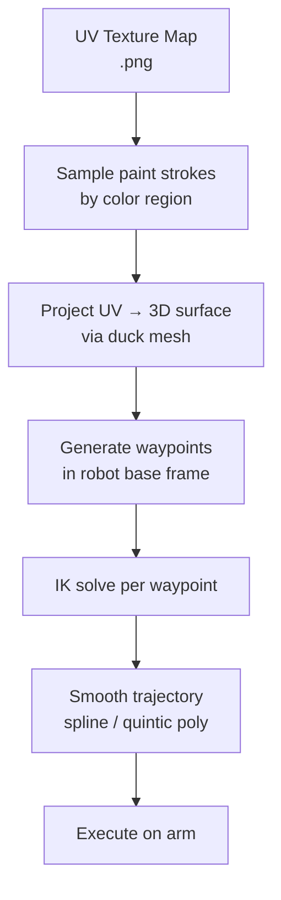

# Week 2 — Pipeline Architecture

**Date:** _Fill in_
**Status:** In progress

---

## What happened this week

> Replace this section with your actual week 2 content.

This week focused on nailing down the technical architecture of the robotics sub-system before writing any code.

### IK solver decision

We evaluated two approaches for inverse kinematics:

=== "Analytical IK"
    - Fast, exact solution
    - Specific to the arm geometry
    - Harder to maintain when constraints change

=== "Numerical IK (Jacobian-based)"
    - General, works for any 6-DOF arm
    - Slower but flexible
    - Easy to add joint limits and obstacle avoidance

We went with **numerical IK** using the Jacobian transpose / damped least squares method, as it gives us more flexibility for the curved duck surface.

### Toolpath generation strategy

The texture map from the AI pipeline is a standard UV-unwrapped PNG. My approach:



---

## Code snippet — Jacobian damped least squares

```python
import numpy as np

def ik_step(J: np.ndarray, error: np.ndarray, damping: float = 0.01) -> np.ndarray:
    """
    One step of damped least squares IK.
    J: (6, n_joints) Jacobian
    error: (6,) task-space error [dx, dy, dz, droll, dpitch, dyaw]
    Returns: (n_joints,) joint velocity delta
    """
    JT = J.T
    dq = JT @ np.linalg.solve(J @ JT + damping**2 * np.eye(6), error)
    return dq
```

---

## Skills demonstrated

!!! note "Inverse Kinematics"
    Implemented and compared analytical vs. numerical IK methods; selected damped least squares for robustness.

!!! note "Trajectory Planning"
    Designed toolpath generation pipeline from UV texture map to robot waypoints.

---

## Next week

- Implement the Jacobian computation for our specific arm
- Test basic pick-and-place motion on the real hardware
- Interface with the Application team to receive the duck mesh + texture
