# Duckify — Portfolio

**Course:** 304 GenAI & Robotics | HES-SO Valais-Wallis | 2025–2026

---

## Project overview

**Duckify** is a full-stack generative AI and robotics pipeline that produces hand-painted 3D rubber ducks:

```mermaid
flowchart LR
    Client["👤 Client"] --> LLM["🤖 LLM Pipeline\n2 devs"]
    LLM --> Print["🖨️ 3D Model Printing\n1 dev"]
    LLM --> Trace["🎨 Texture Mapping\n& Tracing\n2 devs"]
    Print --> Arm["🦾 Robotic Arm Painting\n3 devs"]
    Trace --> Arm
    Arm --> Duck["🦆 Painted Duck"]
```

The project involves **8 developers** plus a CEO, CTO, and project manager:

| Role | People | Responsibility |
|------|--------|----------------|
| **LLM** | 2 | Prompt pipeline, concept generation |
| **3D Model Printing** | 1 | text-to-3D, print preparation |
| **Website** | 1 | Client-facing interface |
| **Tracing** | 2 | UV mapping, painting path calculation |
| **Robotic Arm** | 3 | Calibration, simulation, arm control |

---

## My role — Robotic Arm

I am part of the **Robotic Arm group** (3 people). My focus within the group:

- Simulation environment setup (ISCoin / Docker)
- Self-collision avoidance in simulation
- Learning and working with the UR3e Python control library
- Bridging the real-arm library with the simulator interface

---

## Weekly journal

| Week | Topic | Status |
|------|-------|--------|
| [Week 1](articles/week-1.md) | Project kickoff — pipeline design, simulation setup | 🔄 In progress |
