# Duckify — Portfolio

**Course:** 304 GenAI & Robotics | HES-SO Valais-Wallis | 2025–2026

---

## Project overview

**Duckify** is a full-stack generative AI and robotics pipeline that produces hand-painted 3D rubber ducks:

```mermaid
flowchart LR
    A[LLM Prompting\nGPT / local model] -->|generates concept| B[3D Model Generation\ntext-to-3D]
    B -->|mesh + UV map| C[Texture Mapping\nAI-generated textures]
    C -->|print-ready file| D[3D Printing\nFDM duck body]
    D -->|physical duck| E[Robotic Arm Painting\n6-DOF arm + toolpath]
    E -->|finished duck| F[Painted Duck 🦆]
```

The project brings together a team of ~9 students across three sub-teams:

| Sub-team | Responsibility |
|----------|----------------|
| **Application** | LLM interface, user prompts, model generation pipeline |
| **Captors / Vision** | Camera feedback, quality control, workpiece registration |
| **Robotics / Data** | 6-DOF arm control, inverse kinematics, painting toolpaths |

---

## My role — Robotic Arm Painting

I am responsible for the **robotic arm painting** sub-system. My work spans:

- Forward & inverse kinematics for a 6-DOF arm
- Toolpath generation from UV texture maps
- TCP calibration and workpiece registration
- Surface-normal alignment for consistent paint application
- Trajectory planning and force/velocity control

---

## Weekly journal

| Week | Topic | Status |
|------|-------|--------|
| [Week 1](articles/week-1.md) | Project kickoff — team structure, pipeline design | ✅ |
| [Week 2](articles/week-2.md) | Architecture decisions — IK solver, robot SDK | ✅ |
