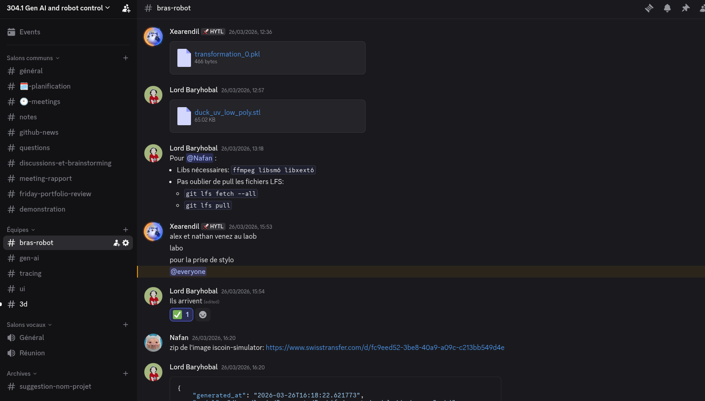

# Communicating clearly and efficiently

- *By sharing on a wide range of topics*
- *By choosing the appropriate communication medium*
- *By adapting the style of language to specific audiences*

---

- **Robotic arm technical presentation** -- I presented the technical foundations of the robotic arm pipeline (kinematics, simulation, pipeline architecture) to the full team during the Week 1 presentation. [Slides](https://github.com/Toys-R-Us-Rex/Duckify/blob/main/docs/presentations/20260220_robotic_arm.pdf)

- **Collision problem presentation** -- I identified a blocking issue with collision checking and prepared a presentation to communicate the problem clearly to the team, explaining why it was blocking progress and what solutions were available. [Slides](../assets/pdf/presentation_collisions.pdf)

- **Cross-team integration meeting** -- met with Kevin (GenAI) and Louis (project manager) to define the data interface between the tracing output and the robot input, translating robotic constraints for other sub-teams.

- **Daily meeting scribe** -- took on the rotating scribe role, producing structured meeting notes. [Example](https://github.com/Toys-R-Us-Rex/Duckify/blob/main/docs/meetings/daily/2026-02-24.typ)

- **Weekly advancement presentations** -- I presented the robot team's progress several times during the weekly meetings with the CTO and product owner, adapting my explanations to a non-technical audience and highlighting blockers and next steps. [Weekly meeting notes](https://github.com/Toys-R-Us-Rex/Duckify/tree/main/docs/meetings/weekly)

- **Discord as real-time communication hub** -- I set up Discord channels for the project and pushed for my colleagues to keep it open during lab sessions, so they could react quickly if I needed something while working on the robot. This made communication between the lab and the rest of the team much faster.

??? note "Discord channels"
    
