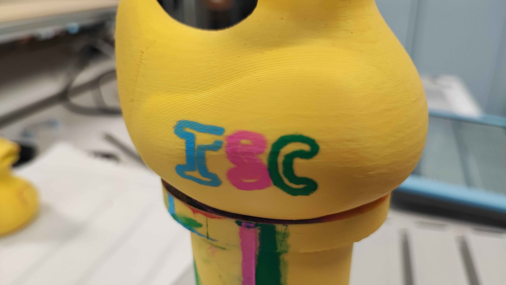
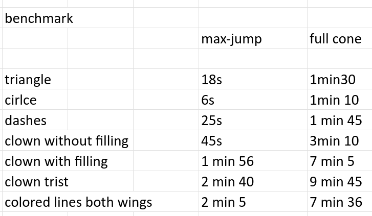

# Evaluating an IT system

- *By implementing targeted and appropriate performance tests*
- *By using the right tools*
- *By critically commenting on the results produced and measured*
- *By producing an objective and relevant report describing the characteristics and performance of the system*

---

- **Incremental drawing tests on 3D surfaces** -- I tested the drawing pipeline progressively, from flat paper to trapezoid faces to the duck, comparing PyBullet-generated toolpaths against physical results on the real UR3e. Each step revealed specific failures that I diagnosed and fixed. The full progression is documented in the [evaluation report](../assets/pdf/evaluation_systeme_bras_robot.pdf).

??? note "First successful drawing on the duck"
    

??? note "Drawing on the duck"
    

??? note "Video of the robot painting on the duck"
    local

??? note "Lemniscate drawing video"
    <video controls width="100%">
    <source src="../assets/videos/leminscate_drawing.mp4" type="video/mp4">
    </video>

- **Joint-angle trajectory analysis** -- I visualised planned joint-angle trajectories to detect discontinuities (unsafe jumps between waypoints). This allowed me to identify that the IK solver was picking inconsistent configurations for nearby points. [Joint trajectory notebook]()

??? note "Joint-angle trajectory plot showing discontinuities"
    

- **Pathfinding algorithm speed evaluation** -- I measured the computation time of the pathfinding algorithm to evaluate whether it could run within acceptable limits for the full pipeline.

??? note "Pathfinding benchmark results"
    

- **Path smoothness evaluation** -- I evaluated the smoothness of the robotic arm's path by comparing joint trajectories before and after the smoothing pass, to verify that the configuration flipping problem was resolved. I also plotted the IK solutions to figure out why some were not selected by the solver. [Smoothing report](../assets/pdf/smoothing_report.pdf)