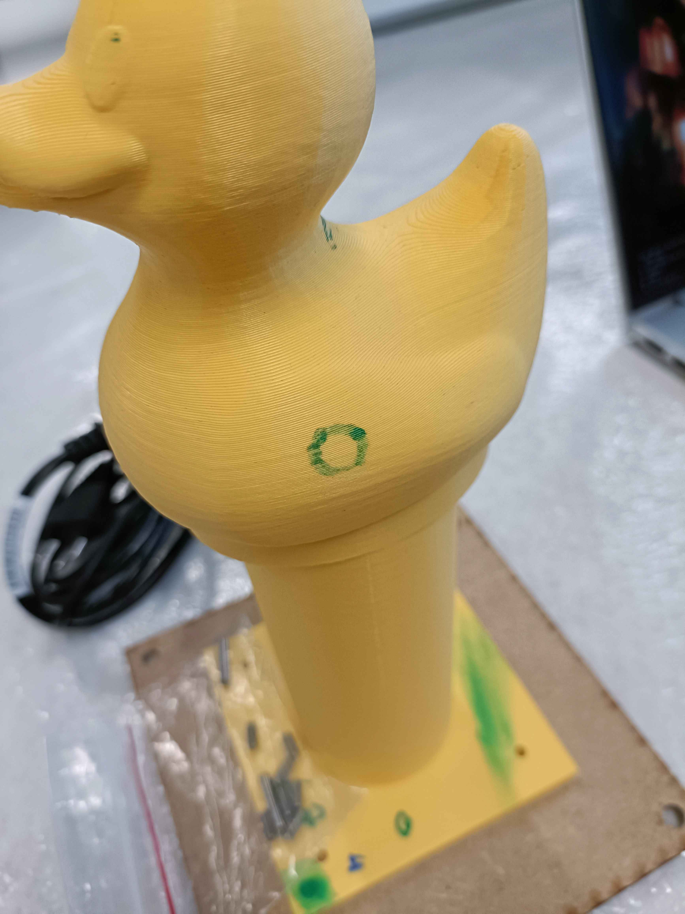
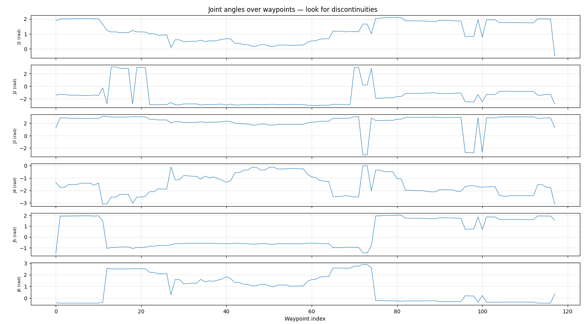

# Evaluating an IT system

- *By implementing targeted and appropriate performance tests*
- *By using the right tools*
- *By critically commenting on the results produced and measured*
- *By producing an objective and relevant report describing the characteristics and performance of the system*

---

- **Incremental drawing tests on 3D surfaces** -- I tested the drawing pipeline progressively, from flat paper to trapezoid faces to the duck, comparing PyBullet-generated toolpaths against physical results on the real UR3e. Each step revealed specific failures that I diagnosed and fixed. The full progression is documented in the [evaluation report](../assets/pdf/evaluation_report.pdf).

Lemniscate drawing video

<video controls width="100%" src="../assets/videos/lemniscate_drawing.mp4"></video>

First successful drawing on the duck

- **Joint-angle trajectory analysis** -- I visualised planned joint-angle trajectories to detect discontinuities (unsafe jumps between waypoints). This allowed me to identify that the IK solver was picking inconsistent configurations for nearby points. The plot below shows an example of such discontinuities. [Joint trajectory notebook]()

Joint-angle trajectory plot showing discontinuities

- **Pathfinding algorithm speed evaluation** -- I measured the computation time of the pathfinding algorithm to evaluate whether it could run within acceptable limits for the full pipeline. [Pathfinding benchmark results]()

- **Path smoothness evaluation** -- I evaluated the smoothness of the robotic arm's path by comparing joint trajectories before and after the smoothing pass, to verify that the configuration flipping problem was resolved. [Smoothness evaluation report]()